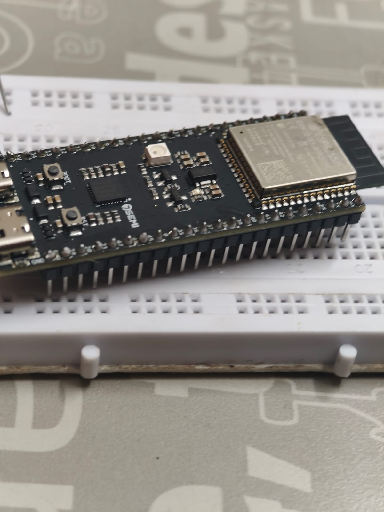
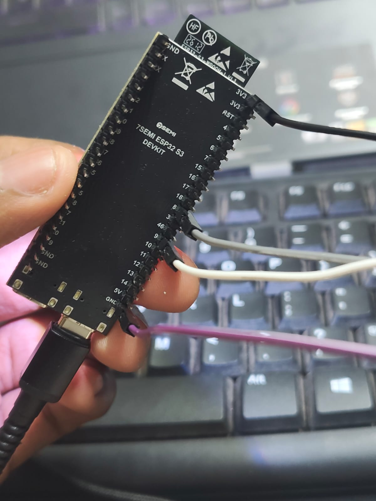
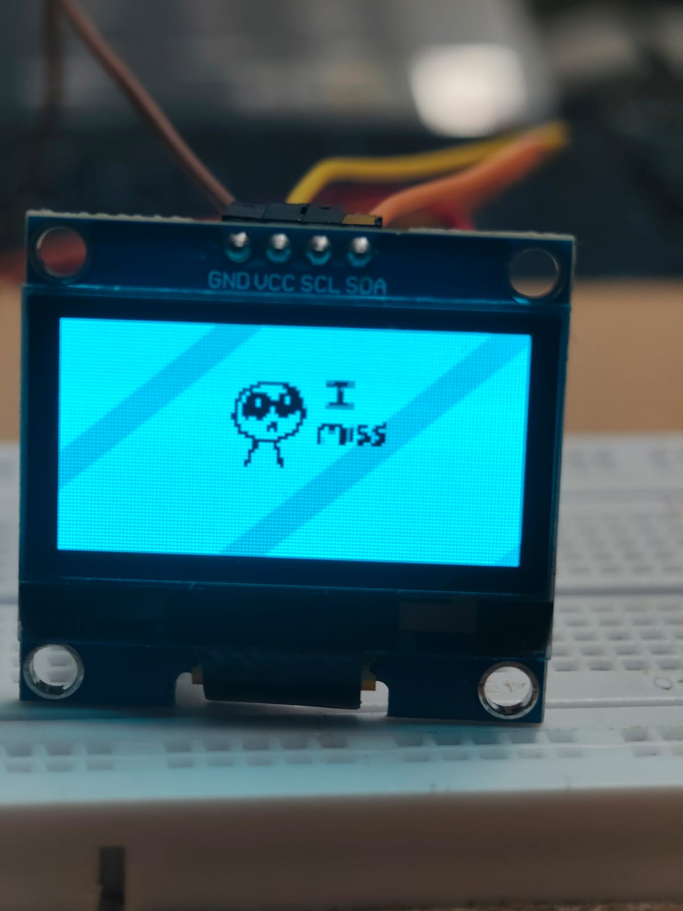
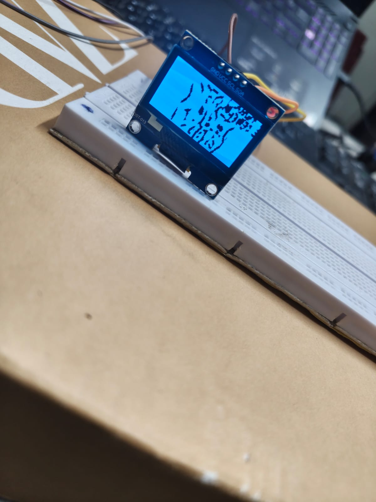
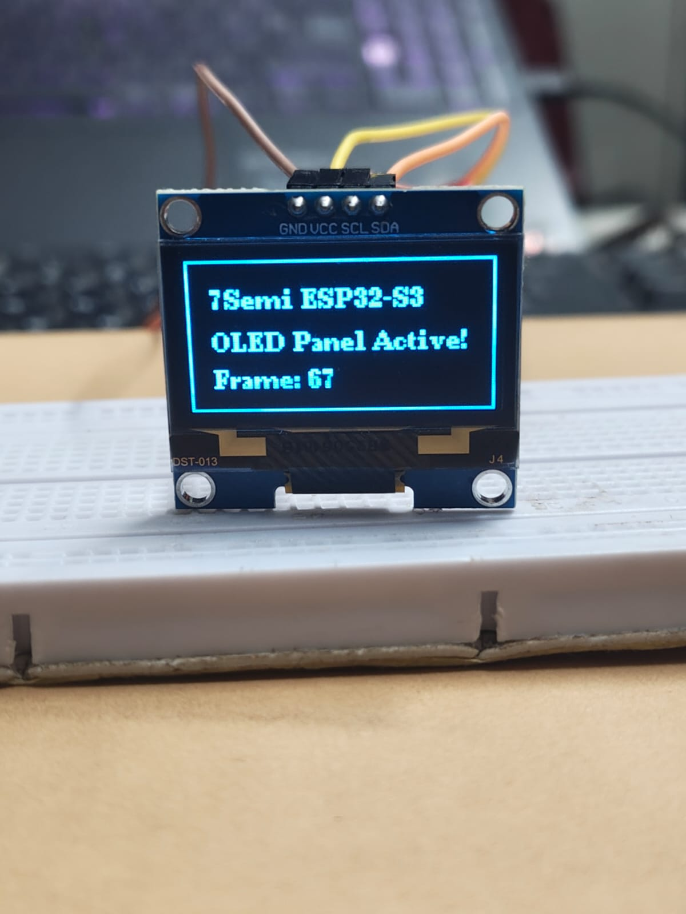
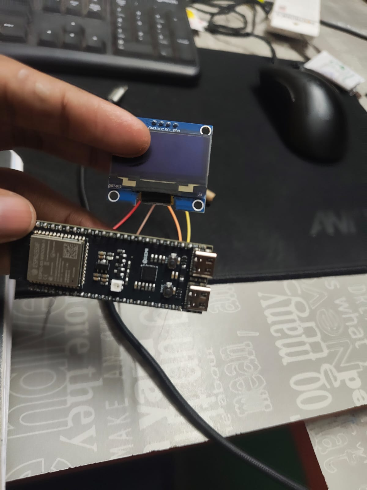

# ESP32-S3 OLED Video Display Project Log

## Project focus

Converting a normal video into monochrome frame data and playing it on a 128×64 SH1106 OLED with an ESP32-S3.

This log intentionally covers **only the video-display project**, not the later Smart Clock work.


## Project Photos

### Hardware



The ESP32-S3 development board used as the controller for the OLED video display.

### OLED and Wiring



The OLED was connected over I²C using **GPIO 11 (SDA)** and **GPIO 12 (SCL)**, with 3.3V power and GND.

### Initial OLED Test



A successful OLED test confirmed that the display, I²C communication and SH1106 initialization were working.

### Debugging the Frame Data



One of the important debugging stages was identifying the distorted image caused by a mismatch in how the frame bits were packed and interpreted.

### Frame Playback Verification



The OLED successfully displayed the test output, including the **7Semi ESP32-S3** board name and a live frame count, confirming that frame playback was functioning.

### Final Result



The completed hardware setup successfully plays the converted monochrome video on the 128×64 OLED.

## Hardware

**Board:** 7Semi ESP32-S3 Dev BoardC-1 N8R8

**OLED:** 1.3-inch 128×64 I²C monochrome OLED, ultimately used as an SH1106.

### Working wiring

| OLED | ESP32-S3 |
|---|---|
| VCC | 3.3V |
| GND | GND |
| SDA | GPIO 11 |
| SCL | GPIO 12 |

I²C address: `0x3C`

## Software

- Arduino IDE 2.x
- ESP32 Arduino board package
- Adafruit GFX Library
- Adafruit SH110X

The final display path used **Adafruit GFX + Adafruit SH110X** because the generated bitmap data matched Adafruit GFX's `drawBitmap()` format.

## Initial hardware bring-up

The first obstacle was uploading firmware. The ESP32-S3 initially reported:

```text
Failed to connect...
No serial data received
```

Using the **BOOT button during upload** put the board into the required bootloader state. Uploads then completed successfully.

A simple LED blink test established that the ESP32 was running uploaded firmware before OLED debugging began.

## I²C and OLED debugging

An I²C scanner was used before attempting video playback. The OLED was found at:

```text
0x3C
```

This separated hardware/I²C problems from video problems.

The display was initially treated as an SSD1306, but the working controller configuration was ultimately identified as **SH1106**.

The working initialization became:

```cpp
#include <Wire.h>
#include <Adafruit_GFX.h>
#include <Adafruit_SH110X.h>

Adafruit_SH1106G display(128, 64, &Wire, -1);

Wire.begin(11, 12);
Wire.setClock(800000);

display.begin(0x3C, true);
```

## The video problem

An MP4 cannot simply be sent to a 128×64 monochrome OLED.

Each frame contains:

```text
128 × 64 = 8192 pixels
```

At one bit per pixel:

```text
8192 bits / 8 = 1024 bytes per frame
```

So the raw representation is:

```text
128×64 monochrome frame → 1024 bytes
```

A video is therefore essentially a sequence of these 1024-byte frames.

## Video conversion

The main conversion tool used for the project was the **ESP32 OLED Video Converter by Tri Wahyu**:

urlESP32 OLED Video Converterhttps://triwahyu45.github.io/ESP32-OLED-Video-Converter/

It supports 128×64 output, monochrome conversion, threshold/dither controls, contrast and brightness, inversion, frame extraction, live OLED preview, and C-array generation. citeturn0search0turn0view0

The conversion pipeline was:

```text
MP4
 ↓
crop / resize
 ↓
grayscale
 ↓
threshold or dithering
 ↓
1-bit image
 ↓
packed bytes
 ↓
VideoFrame.h
```

The converter's generated example also supports choosing SSD1306 or SH1106 and uses `drawBitmap()` for the frame data. It sets the I²C clock to 800 kHz for faster transfers. citeturn0view0

## The biggest visual failure

One of the most important failures was a severely distorted/scrambled image on the OLED.

The video data itself was not necessarily corrupt. The problem was that the frame bytes were being interpreted with the wrong bitmap format/bit ordering.

The existing frame data was packed for the Adafruit GFX `drawBitmap()` convention. Feeding it into a different interpretation, such as a U8g2 XBM path without converting the bit layout, produced scrambled images.

### Fix

The player was returned to:

```text
Adafruit GFX
      +
Adafruit SH110X
      +
drawBitmap()
```

This was an important embedded-systems lesson:

> Correct data is useless if the renderer interprets its bit layout differently.

## Frame timing

The player used a non-blocking `millis()` timing loop rather than relying entirely on `delay()`:

```cpp
unsigned long currentMillis = millis();

if (currentMillis - previousMillis >= FRAME_DELAY) {
    previousMillis = currentMillis;

    // draw frame
}
```

A value around `41 ms` was used in one video configuration, corresponding to roughly 24 FPS.

## Source-video processing

A later source video was approximately:

- 720×1280
- 24 FPS
- about 10.3 seconds

The useful content occupied a much smaller central region, with large black margins. Cropping before resizing prevented those margins from wasting OLED pixels.

The video was then reduced to:

```text
128×64
1-bit monochrome
```

Dithering/thresholding was used to preserve as much visual detail as possible.

The actual number of decoded frames was used when the video decoder returned fewer frames than the metadata implied, rather than fabricating frames.

## Why dithering matters

A monochrome OLED has only:

```text
ON / OFF
```

A normal video has many brightness levels.

Simple thresholding turns every pixel into either black or white. Dithering instead uses patterns of black and white pixels to approximate intermediate brightness.

That can preserve much more detail on a tiny display.

## Storage approaches

Two approaches were explored.

### `VideoFrame.h`

Frames can be compiled into a C/C++ array:

```cpp
const unsigned char video_frames[][1024] PROGMEM = {
    { ... },
    { ... },
};
```

Advantages:

- simple playback
- direct frame access
- no filesystem code

Disadvantages:

- very large source file
- replacing the video means replacing/recompiling the header
- flash/partition limits become important

### `video.bin`

Frames can instead be stored sequentially in a raw binary file:

```text
video.bin

[frame 0: 1024 bytes]
[frame 1: 1024 bytes]
[frame 2: 1024 bytes]
...
```

This separates the firmware from the video data and is a better architecture for a reusable player.

A related ESP32 OLED project documents the same 1024-byte-per-frame representation for 128×64 monochrome video. citeturn0search4turn0search5

## Memory constraints

Raw monochrome video grows quickly:

```text
1024 bytes/frame
```

At 10 FPS:

```text
10,240 bytes/second
≈ 600 KB/minute
```

At 30 FPS:

```text
30,720 bytes/second
≈ 1.8 MB/minute
```

This showed that video playback on an ESP32 is as much a **storage problem** as a processing problem.

## Main difficulties and solutions

| Difficulty | What happened | Solution |
|---|---|---|
| ESP32 upload failure | No serial data during connection | Use BOOT during upload |
| OLED blank | Display communication uncertain | Run I²C scanner |
| Wrong controller assumption | SSD1306 path did not match hardware | Use SH1106 + Adafruit SH110X |
| Scrambled video | Bitmap data interpreted with wrong packing | Use Adafruit GFX `drawBitmap()` |
| Vertical video distortion | Source aspect ratio did not match 128×64 | Crop useful content before resizing |
| Poor monochrome detail | Simple threshold lost shades | Use dithering |
| Large video files | Raw frames consume flash quickly | Explore binary filesystem storage |

## Debugging method learned

The project became much easier once each layer was tested separately:

```text
1. ESP32 upload
        ↓
2. LED blink
        ↓
3. I²C scan
        ↓
4. Static OLED test
        ↓
5. Single bitmap
        ↓
6. Multiple frames
        ↓
7. Full video
```

This prevented hardware, driver, bitmap, and video-processing problems from being mixed together.

## Final architecture

```text
              MP4
               │
               ▼
      ┌─────────────────┐
      │ Video Converter │
      │ crop / resize   │
      │ grayscale       │
      │ dither          │
      │ pack 1-bit data │
      └────────┬────────┘
               │
               ▼
        VideoFrame.h
          or video.bin
               │
               ▼
        ┌─────────────┐
        │  ESP32-S3   │
        │             │
        │ frame timing│
        │ frame select│
        │ drawBitmap  │
        └──────┬──────┘
               │ I²C
               ▼
        ┌─────────────┐
        │ SH1106 OLED │
        │   128×64    │
        └─────────────┘
```

## What I learned

This project became a practical introduction to several parts of embedded development.

### Hardware

- ESP32-S3 bootloader/upload behavior
- I²C wiring and address scanning
- OLED controller identification
- 3.3V hardware interfacing

### Firmware

- Arduino ESP32 development
- Adafruit GFX
- Adafruit SH110X
- bitmap rendering
- `PROGMEM`
- frame timing with `millis()`
- I²C performance

### Data processing

- video frame extraction
- cropping and resizing
- grayscale conversion
- thresholding
- dithering
- 1-bit pixel packing
- bitmap bit ordering

### Embedded constraints

The most useful realization was that a tiny 128×64 display does not make video data tiny. Every frame still costs 1024 bytes, so hundreds of frames quickly become megabytes of flash.

## Possible next steps

The project can be extended with:

- `video.bin` playback from LittleFS/SPIFFS
- SD-card video storage
- adjustable FPS
- improved dithering
- frame skipping
- PSRAM buffering
- pause/restart buttons
- multiple-video selection
- delta-frame compression

A particularly interesting future experiment would be a lightweight **delta-frame codec**, where only changed pixels between frames are stored.

## Portfolio takeaway

This project is valuable because it captures the progression from **"I want an ESP32 to play a video"** to understanding the entire data path:

```text
high-level MP4
      ↓
image processing
      ↓
1-bit representation
      ↓
binary storage
      ↓
ESP32 firmware
      ↓
I²C transfer
      ↓
OLED pixels
```

It was not just an OLED animation project. It became a hands-on exercise in embedded hardware debugging, firmware development, data representation, memory constraints, and real-time rendering.

## References

- urlESP32 OLED Video Converter by Tri Wahyuhttps://triwahyu45.github.io/ESP32-OLED-Video-Converter/
- urlRelated ESP32 OLED video reference projecthttps://github.com/kishorebhagya/esp32-oled-lyrics-video-display

## Project status

**Status:** Working video-display prototype

**MCU:** ESP32-S3

**Display:** 1.3-inch SH1106, 128×64

**Interface:** I²C

**I²C address:** `0x3C`

**Working pins:** SDA GPIO 11, SCL GPIO 12

**Rendering:** Adafruit GFX + Adafruit SH110X

**Video:** 1-bit monochrome frame sequence

**Primary achievement:** Converted conventional video into microcontroller-compatible monochrome frame data and played it back on a tiny 128×64 OLED.
